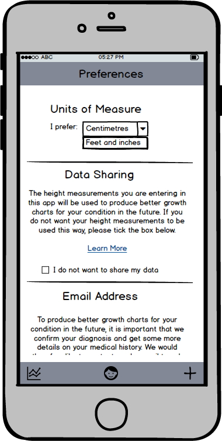

# GrowthShare

A mobile app that allows patients with bone dysplasias to record their height and plot it on a growth chart appropriate for their condition.

## Problem

A growth chart is a chart that shows the normal range for height at a given age (https://www.cdc.gov/growthcharts/). Plotting a child’s height on a growth chart is an easy way to monitor a child’s health. If a child’s height falls outside of the normal range, this could be an early warning sign that there is a serious medical problem.

Children with bone dysplasias have a genetic defect that prevents their bones from growing normally. The most common types of bone dysplasias are Achondroplasia, Pseudoachondroplasia, Diastrophic Dysplasia and Spondyloepiphyseal Dysplasia Congenita (SEDC). As these children grow differently from other children, they need to be plotted on growth charts specific to their condition. Since bone dysplasias are rare, it is difficult to collect sufficient measurements from lots of children with these conditions to produce a high quality growth chart. Low quality growth charts based on a small amount of measurements do exist, but they are rarely used as many doctors are not aware of their existence. The goal of this project is therefore twofold: 1) promote the use of the existing growth charts and 2) collect height measurements from patients using the app to produce better growth charts in the future.

## Workflow

On first launch, the user will be given some information about the app and asked to agree to sharing of the growth data entered.  The User will also be asked to provide an email address. 

    

The User is then asked to enter First Name, Sex, Date of Birth and Diagnosis of the person whose growth will be tracked. The diagnosis field should use autocomplete from a list of diagnosis that I will provide.

After adding a person, user will be taken to the Chart View. On first launch, this will show some instructions. On subsequent launches, the app will open directly to the Chart View.

|

For some disorders, growth charts are available. These can be found [here](PublishedGrowthCharts/). If published data includes mean and SD, these can be used to create the growth charts. If only the chart is published, mean and SD can be read off the charts. Curves can be smoothed with some smoothing algorithm. Plot Mean, +1 SD, +2 SD, -1SD, -2 SD.

For other diagnoses, no growth charts are available. In this case, individual measurements collected from other users will be plotted as dots on a scatter plot. Once we have collected sufficient measurements to create a proper growth chart, we can replace the scatterplot with a proper growth chart. User is shown an alert explaining this.

To add a measurement, user clicks on ‘+’ icon and enters height. Unit (cm vs feet and inches) can be set in preferences. The date defaults to the current date, but can be set to a different date.

|

Measurements are displayed as dots, connected with lines, on the chart.

To delete a measurement, user taps on ‘table’ icon in right upper corner, this shows the entered measurements in a table format. User can click on ‘trash’ icon to delete an incorrect measurement. Clicking on ‘chart’ icon closes table view and goes back to chart view.

Tapping on ‘face’ icon shows a menu. A tick indicates currently selected person. User can switch to another person (for example second affected child) or add a new person. User can only see persons he/she has added herself.

Adding an additional person is similar to adding the first person.

Tapping the ‘gear’ symbol shows the Preferences. User can choose between cm and Feet and Inches as the Unit of Measure. User can also change Data Sharing consent and email settings. The text is the same as used in the walkthrough at first launch.

